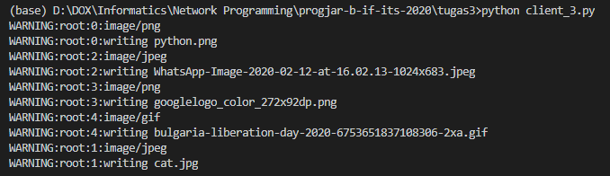

# Tugas 3 - Client Request menggunakan Threading

Threading memungkinkan pengerjaan suatu proses secara bersamaan.

Digunakan indexing untuk menunjukkan Thread yang berbeda, terlihat gambar satu yang memiliki size terbesar terunduh diurutan terakhir, menunjukkan threading bekerja.