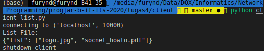
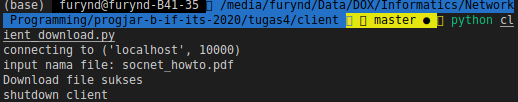
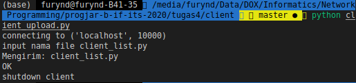

Tugas 4

protocol yang tersedia:
    list, download, upload

### list
penggunaan : list
 
Melihat list file yang ada di server
 
contoh respon :

menampilkan list kosong bila tidak ada file dalam server
  

### download
penggunaan : download [nama_file]
 
Mendownload file [nama_file] dari server
 
contoh respon :

mengembalikan Error jika file request tidak ditemukan di server
  

### upload
penggunaan : upload [nama_file]
 
Mengupload file [nama_file] ke server
 
contoh respon :

Tidak direquest apabila file tidak ada